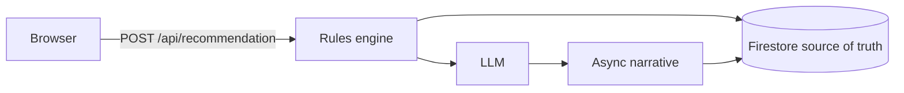

# SmartVisaAI

[](https://github.com/giova0929/smartvisaai-public/actions/workflows/ci.yml)

SmartVisaAI is a visa-guidance product for Australia ([https://smartvisaai.com.au](https://smartvisaai.com.au)).

Applicants enter their details in the browser and receive a recommendation from a rules engine through `POST /api/recommendation`. A language model writes a narrative of that recommendation asynchronously.

A team of three is building SmartVisaAI.

## Request path



Firestore is the source of truth for the recommendation and the narrative.

## Screenshots

Screenshots of onboarding, recommendation, and dashboard will be added.

## Stack

- Browser client
- `POST /api/recommendation`
- Rules engine
- Async LLM narrative
- Firestore
- Payments prepared but off

## Status

In development.

## What this repository does not include

The preflight filter under `examples/preflight-filter/` is the only product code published here. This repository does not include:

- The private application
- Eligibility rules
- Credentials
- Partner code

## In this repository

- [Decision records](docs/decisions/)
- [API contract example](docs/api-contract.md)
- [Preflight filter example](examples/preflight-filter/)

## Tests

From the repository root:

```bash
npm ci
npm test
```

Continuous integration runs `npm ci && npm test` on push and pull request.
